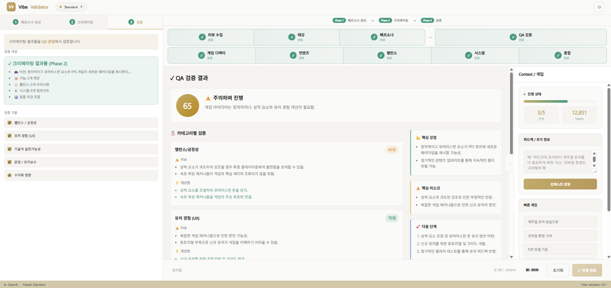
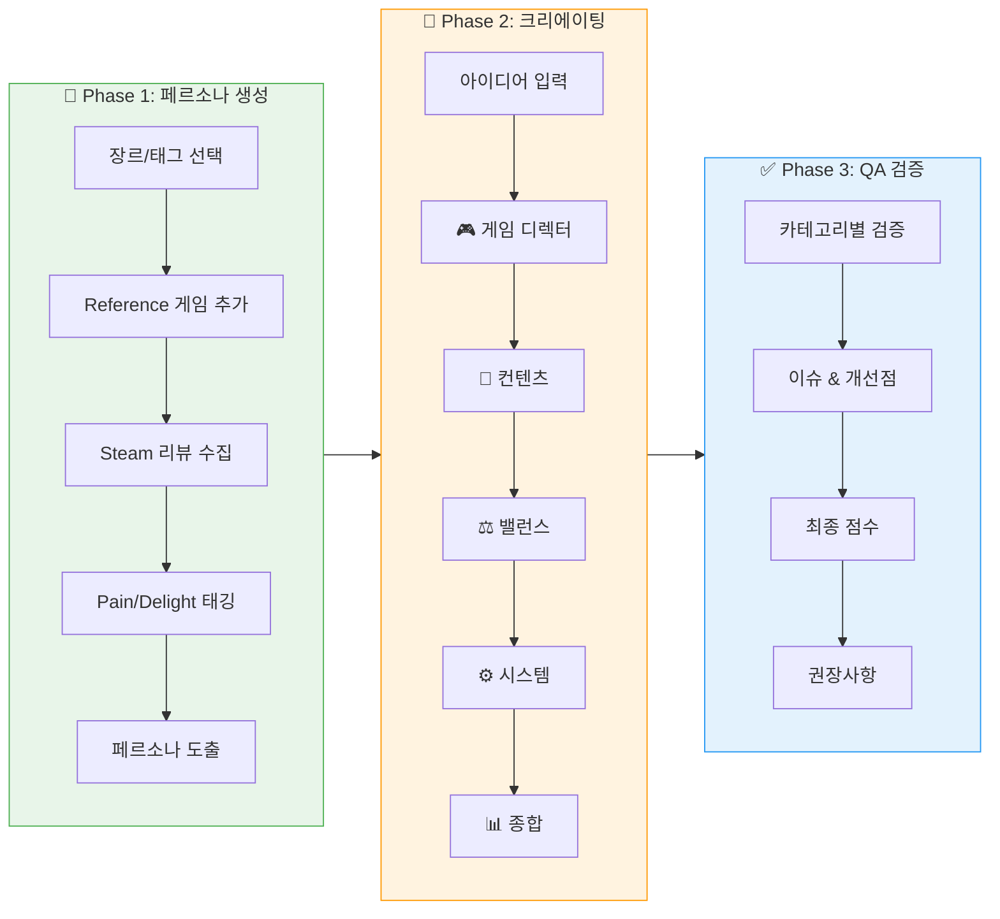
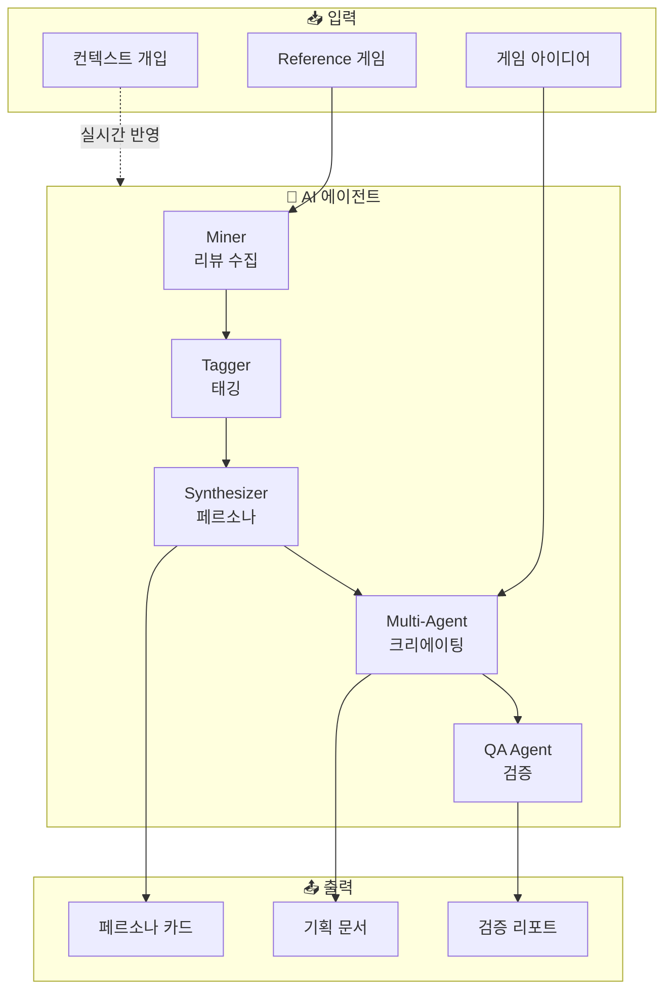

# 🎮 Vibe Validator

> Steam 리뷰 기반 게임 아이디어 검증 도구



## 🔄 워크플로우





## 📋 개요

Vibe Validator는 게임 아이디어를 **Steam 리뷰 데이터**와 **AI 에이전트**를 활용하여 체계적으로 검증하는 도구입니다.

### 주요 기능

- **Phase 1: 페르소나 생성**
  - Reference 게임의 Steam 리뷰 수집
  - Pain Point / Delight Point 태깅
  - 타겟 유저 페르소나 자동 도출

- **Phase 2: 크리에이팅**
  - 🎮 게임 디렉터: 전체 비전 및 방향성
  - 📝 컨텐츠 디자이너: 기능 제안
  - ⚖️ 밸런스 디자이너: 밸런스 검토
  - ⚙️ 시스템 디자이너: 시스템 아키텍처
  - 📊 종합: 에이전트 의견 통합

- **Phase 3: QA 검증**
  - 카테고리별 검증 (밸런스, UX, 기술, 운영, 수익화)
  - 이슈 및 개선점 도출
  - 최종 점수 및 권장사항

## 🚀 시작하기

### 1. 요구사항

- Python 3.9+
- 웹 브라우저 (Chrome 권장)

### 2. 설치

```bash
# 저장소 클론
git clone https://github.com/your-username/IdeationHelper.git
cd IdeationHelper

# 의존성 설치
pip install -r requirements.txt
```

### 3. 실행

#### Web UI (권장)
```bash
# 브라우저에서 직접 열기
start ui/index.html   # Windows
open ui/index.html    # macOS
```

#### CLI
```bash
python main.py
```

### 4. API 키 설정

UI 우측 상단의 ⚙️ 설정 버튼을 클릭하여 API 키를 입력하세요:

- **OpenAI**: `sk-...`
- **Anthropic**: `sk-ant-...`
- **Google AI (Gemini)**: `AIza...`

> ⚠️ API 키는 브라우저 로컬에만 저장되며, 서버로 전송되지 않습니다.

## 📁 프로젝트 구조

```
IdeationHelper/
├── ui/
│   └── index.html      # Web UI (단일 파일)
├── src/
│   ├── agents/         # AI 에이전트
│   │   ├── miner.py    # 리뷰 수집
│   │   ├── tagger.py   # 태깅
│   │   ├── synthesizer.py
│   │   └── editor.py
│   ├── config.py
│   └── data/
│       └── persona_frameworks.json
├── docs/
│   ├── ui_specification.md
│   └── screenshot.png
├── output/             # 생성된 결과물 (gitignore)
├── config.yaml         # 설정 파일
├── main.py
├── requirements.txt
└── README.md
```

## ⚙️ 설정

`config.yaml`에서 프리셋을 선택할 수 있습니다:

| 프리셋 | 리뷰 수 | 용도 |
|--------|---------|------|
| `free` | 30개/게임 | 빠른 테스트 |
| `standard` | 100개/게임 | 일반 사용 (권장) |
| `detailed` | 300개/게임 | 꼼꼼한 분석 |

## 🎯 사용 흐름

```
1. 장르/태그 선택
2. Reference 게임 추가 (Steam AppID)
3. Phase 1 실행 → 페르소나 생성
4. 아이디어 입력
5. Phase 2 실행 → 크리에이팅
6. Phase 3 실행 → QA 검증
7. 결과 확인 및 개선점 검토
```

## 🔧 컨텍스트 개입

분석 중 언제든 우측 패널에서 컨텍스트를 추가할 수 있습니다:

- "캐주얼 유저 중심으로 분석해줘"
- "모바일 환경도 고려해줘"
- "F2P 모델 기준으로 분석해줘"

## 📝 License

MIT License

## 🤝 Contributing

이슈 및 PR 환영합니다!
