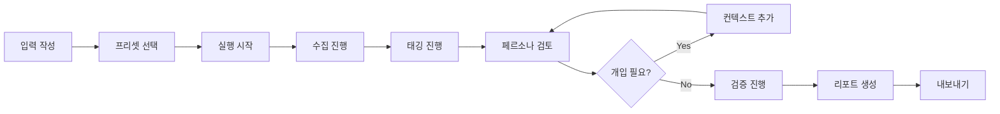

# Vibe Validator UI 스펙 문서
> 아이디어 검증 도구의 웹 기반 인터페이스 설계

---

## 1) 개요

### 목적
- **파이프라인 시각화**: 수집 → 태깅 → 페르소나 → 검증 → 리포트 진행 상황 표시
- **실시간 개입**: 각 단계에서 사용자가 추가 컨텍스트 입력 가능
- **결과 탐색**: 페르소나, 리스크, 검증 결과를 인터랙티브하게 확인

### 기술 스택
- **프론트엔드**: 순수 HTML/CSS/JS (단일 파일, 의존성 없음)
- **스타일**: 다크 모드 기본, Steam/게임 감성
- **백엔드 연동**: Python CLI → JSON 파일 → UI 렌더링

---

## 2) 레이아웃 구조

```
┌─────────────────────────────────────────────────────────────────────┐
│ [Header] 로고 | 프리셋 선택 | 비용 표시 | 설정                        │
├──────────┬──────────────────────────────────────────┬───────────────┤
│          │ [Pipeline] 수집 → 태깅 → 페르소나 → 검증 → 리포트         │
│ [Sidebar]├──────────────────────────────────────────┼───────────────┤
│  입력    │                                          │ [Intervention]│
│  정보    │           [Main Content]                 │  컨텍스트     │
│          │           결과 표시 영역                  │  추가 패널    │
│          │                                          │               │
├──────────┴──────────────────────────────────────────┴───────────────┤
│ [Footer] 통계 | 액션 버튼들                                          │
├─────────────────────────────────────────────────────────────────────┤
│ [Status Bar] AI 모델 | 토큰 | 비용                                   │
└─────────────────────────────────────────────────────────────────────┘
```

### 영역별 역할

| 영역 | 너비 | 역할 |
|------|------|------|
| **Header** | 100% | 브랜딩, 프리셋 선택, 전역 설정 |
| **Sidebar** | 300px | 입력 정보 (아이디어, 장르, 경쟁작) |
| **Pipeline** | flex | 파이프라인 단계 시각화 |
| **Main Content** | flex-1 | 결과 카드들 (리뷰 분포, 페르소나, 리스크) |
| **Intervention Panel** | 360px | 추가 컨텍스트 입력, 빠른 개입, 히스토리 |
| **Footer** | 100% | 액션 버튼, 통계 요약 |
| **Status Bar** | 100% | AI 모델, 토큰 사용량, 비용 |

---

## 3) 컴포넌트 상세

### 3.1 Header

```html
┌─────────────────────────────────────────────────────────────────┐
│ 🎮 VibeValidator │ [🔵 Standard ▼] │ ─────── │ 🔄 4 req │ 💰 $0 │ ⚙️ │
└─────────────────────────────────────────────────────────────────┘
```

| 요소 | 기능 | 인터랙션 |
|------|------|----------|
| 로고 | 브랜딩 | 클릭 시 홈 |
| 프리셋 선택 | Free/Standard/Detailed | 드롭다운 모달 |
| 비용 표시 | Request 수, 예상 비용 | 실시간 업데이트 |
| 설정 버튼 | 상세 설정 모달 | 클릭 시 모달 |

### 3.2 Sidebar (입력 정보)

```
┌─────────────────────┐
│ 📝 입력 정보        │
├─────────────────────┤
│ ▸ 아이디어          │
│ ┌─────────────────┐ │
│ │ 배틀로얄에 로그  │ │
│ │ 라이크 요소...   │ │
│ └─────────────────┘ │
│                     │
│ ▸ 장르              │
│ [🎯 Shooter] [🎲 BR]│
│ [+ 추가]            │
│                     │
│ ▸ 경쟁작 (Steam)    │
│ ┌─────────────────┐ │
│ │ 🎮 PUBG         │×│
│ │ 🎮 Apex Legends │×│
│ │ 🎮 Hunt         │×│
│ │ [+ 경쟁작 추가] │ │
│ └─────────────────┘ │
└─────────────────────┘
```

**입력 필드 스펙**:

| 필드 | 타입 | 검증 | 필수 |
|------|------|------|------|
| 아이디어 | textarea | 5~1000자 | ✅ |
| 장르 | tag-select | 1~3개 | ✅ |
| 경쟁작 | list[{name, appid}] | 2~5개 | ✅ |

### 3.3 Pipeline Header

```
┌─────────────────────────────────────────────────────────────────┐
│ [✓ 수집] → [✓ 태깅] → [👥 페르소나] → [🔍 검증] → [📋 리포트] │
│  300개     배치완료    검토 대기      대기중       대기중       │
└─────────────────────────────────────────────────────────────────┘
```

**단계 상태**:

| 상태 | 스타일 | 아이콘 |
|------|--------|--------|
| `completed` | 초록 배경, 체크 | ✓ |
| `active` | 파랑 배경, 애니메이션 | 🔄 / 👥 / 등 |
| `pending` | 회색, 비활성화 | 숫자 |
| `error` | 빨강 배경 | ⚠️ |

**클릭 동작**: 완료된 단계 클릭 시 해당 결과로 스크롤

### 3.4 Main Content (결과 영역)

#### 3.4.1 리뷰 태그 분포

```
┌─────────────────────────────────────────────────────────────┐
│ 📊 리뷰 태그 분포                     [📥 상세] [🔄 재분석] │
│ 300개 리뷰 분석                                             │
├─────────────────────────────────────────────────────────────┤
│ ┌──────────────┐ ┌──────────────┐ ┌──────────────┐          │
│ │🔴 matchmaking│ │🔴 performance│ │🔴 monetization│         │
│ │ ████████ 32% │ │ ███████ 28%  │ │ █████ 18%    │          │
│ └──────────────┘ └──────────────┘ └──────────────┘          │
│ ┌──────────────┐ ┌──────────────┐ ┌──────────────┐          │
│ │🟢 gunfeel    │ │🟢 movement   │ │🟢 depth      │          │
│ │ ██████████45%│ │ █████████ 38%│ │ █████ 22%    │          │
│ └──────────────┘ └──────────────┘ └──────────────┘          │
└─────────────────────────────────────────────────────────────┘
```

#### 3.4.2 페르소나 카드

```
┌─────────────────────────────────────────────────────────────┐
│ 👥 도출된 페르소나                 [+ 추가] [🔄 재생성]      │
│ 4개 페르소나                                                │
├─────────────────────────────────────────────────────────────┤
│ ┌─────────────────────────┐ ┌─────────────────────────┐     │
│ │ 🎯 스피드런 캐주얼  TOP1│ │ 🎮 로그라이크 팬   TOP2 │     │
│ │ New • Short Session     │ │ Mid • Long Session      │     │
│ ├─────────────────────────┤ ├─────────────────────────┤     │
│ │ 목표                    │ │ 목표                    │     │
│ │ [빠른 한판] [쉬운 재미] │ │ [빌드 실험] [성장 체감] │     │
│ │                         │ │                         │     │
│ │ 고통점                  │ │ 고통점                  │     │
│ │ [긴 대기] [복잡한 메타] │ │ [운 의존] [밸런스 붕괴] │     │
│ │                         │ │                         │     │
│ │ 민감요소                │ │ 민감요소                │     │
│ │ [30분+ 게임]            │ │ [P2W 요소]              │     │
│ └─────────────────────────┘ └─────────────────────────┘     │
└─────────────────────────────────────────────────────────────┘
```

**페르소나 카드 인터랙션**:

| 액션 | 동작 |
|------|------|
| 호버 | 테두리 하이라이트 |
| 클릭 | 상세 모달 열기 |
| TOP 배지 | 상위 적합 페르소나 표시 |
| 편집 버튼 | 인라인 편집 모드 |

#### 3.4.3 리스크 목록

```
┌─────────────────────────────────────────────────────────────┐
│ ⚠️ 리스크 TOP 5                                             │
├─────────────────────────────────────────────────────────────┤
│ 🔴 [BALANCE] 로그라이크 RNG와 BR 공정성 충돌                │
│    💡 완화: 스킬 풀 제한 + 티어 밸런싱 + 선택지 제공        │
│                                                             │
│ 🔴 [UX] 하드코어 유저 이탈 가능성                           │
│    💡 완화: 랭크 모드에서 RNG 최소화 옵션 제공              │
│                                                             │
│ 🟡 [EXECUTION] 메타 진행 시스템 복잡도                      │
│    💡 완화: 단계적 언락 + 튜토리얼 강화                     │
└─────────────────────────────────────────────────────────────┘
```

### 3.5 Intervention Panel (개입 패널)

```
┌─────────────────────┐
│ 💬 컨텍스트 추가    │
├─────────────────────┤
│ ▸ 진행 상태         │
│ ████████░░░░ 60%    │
│ 3/5 단계 │ 4 Req    │
├─────────────────────┤
│ ▸ 피드백 / 추가정보 │
│ ┌─────────────────┐ │
│ │ "하드코어 유저  │ │
│ │  보다 캐주얼..." │ │
│ └─────────────────┘ │
│ [🔄 컨텍스트 반영]  │
├─────────────────────┤
│ ▸ 빠른 개입         │
│ [🎯 캐주얼 중심]    │
│ [📱 모바일 고려]    │
│ [💰 F2P 기준]       │
│ [🏆 e스포츠 체크]   │
├─────────────────────┤
│ ▸ 개입 히스토리     │
│ 2분 전: 페르소나 수정│
│ 5분 전: 경쟁작 추가 │
└─────────────────────┘
```

**빠른 개입 버튼 동작**:

| 버튼 | 자동 입력 텍스트 |
|------|------------------|
| 🎯 캐주얼 중심 | "캐주얼 유저를 주 타겟으로 분석해줘. 하드코어는 서브." |
| 📱 모바일 고려 | "모바일 환경(터치, 짧은 세션, 불안정 네트워크)을 중점 고려해줘." |
| 💰 F2P 기준 | "F2P 과금 모델 기준으로 분석해줘. 초기 진입 장벽 최소화." |
| 🏆 e스포츠 체크 | "e스포츠/경쟁 씬 가능성도 체크해줘. 관전 모드, 밸런스 등." |

### 3.6 Footer

```
┌─────────────────────────────────────────────────────────────────┐
│ 📊 4개 페르소나 • 5개 리스크    │ [📥 저장] [🔄 재실행] [▶️ 다음] [✅ 리포트] │
└─────────────────────────────────────────────────────────────────┘
```

### 3.7 Status Bar

```
┌─────────────────────────────────────────────────────────────────┐
│ 🟢 claude-3.5-sonnet │ Preset: Standard │ 🪙 2,847 │ 💰 ~$0.00 │
└─────────────────────────────────────────────────────────────────┘
```

---

## 4) 인터랙션 플로우

### 4.1 기본 플로우



### 4.2 개입 플로우

```
1. 파이프라인 단계 완료
2. 결과 카드 렌더링
3. 사용자 검토
   ├─ 만족 → 다음 단계
   └─ 불만족 → 개입 패널에서 컨텍스트 입력
                ↓
              재분석 실행
                ↓
              결과 갱신
```

### 4.3 상태 관리

```javascript
const AppState = {
  // 입력
  input: {
    idea: "",
    genre: [],
    competitors: [],
  },
  
  // 설정
  config: {
    preset: "standard",  // free | standard | detailed
    model: "claude-3.5-sonnet",
  },
  
  // 파이프라인
  pipeline: {
    currentStep: "persona",  // collect | tag | persona | validate | report
    steps: {
      collect: { status: "completed", data: null },
      tag: { status: "completed", data: null },
      persona: { status: "active", data: null },
      validate: { status: "pending", data: null },
      report: { status: "pending", data: null },
    }
  },
  
  // 개입
  interventions: [
    { timestamp: "2분 전", action: "페르소나 수정", context: "..." },
  ],
  
  // 비용
  usage: {
    requests: 4,
    tokens: 2847,
    cost: 0,
  }
};
```

---

## 5) 모달 & 오버레이

### 5.1 프리셋 선택 모달

```
┌─────────────────────────────────────┐
│ 프리셋 선택                      [×]│
├─────────────────────────────────────┤
│ ○ 🟢 Free                           │
│   30개/게임 • 1~2 req • 한도 절약   │
│                                     │
│ ● 🔵 Standard ⭐                    │
│   100개/게임 • 4~5 req • 일반 사용  │
│                                     │
│ ○ 🟣 Detailed                       │
│   300개/게임 • 8~12 req • 꼼꼼 분석 │
├─────────────────────────────────────┤
│                    [취소] [적용]    │
└─────────────────────────────────────┘
```

### 5.2 페르소나 상세 모달

```
┌───────────────────────────────────────────────────────┐
│ 🎯 스피드런 캐주얼                                [×] │
├───────────────────────────────────────────────────────┤
│ 아키타입: bandwagon_casual                            │
│ 플레이어 타입: New • 세션: Short                      │
│ 동기 축: Action, Social                               │
│ 과금 세그먼트: Minnow ($1~10/월)                      │
├───────────────────────────────────────────────────────┤
│ 📌 목표                                               │
│ • 빠른 한판                                           │
│ • 친구랑 같이 플레이                                  │
│ • 쉬운 재미                                           │
├───────────────────────────────────────────────────────┤
│ 😣 고통점                                             │
│ • 긴 대기시간                                         │
│ • 복잡한 메타                                         │
├───────────────────────────────────────────────────────┤
│ ⚡ 민감 요소                                          │
│ • 30분+ 게임                                          │
│ • 강제 팀플                                           │
├───────────────────────────────────────────────────────┤
│ 📱 모바일 고려사항                                    │
│ • 터치 조작 간소화 필수                               │
│ • 5분 세션 지원                                       │
├───────────────────────────────────────────────────────┤
│ 📊 근거                                               │
│ • 태그 분포: matchmaking(32%), performance(28%)       │
│ • 샘플: "매칭 왜이렇게 오래걸림 ㅋㅋ"                  │
├───────────────────────────────────────────────────────┤
│              [수정] [삭제] [닫기]                     │
└───────────────────────────────────────────────────────┘
```

### 5.3 경쟁작 추가 모달

```
┌─────────────────────────────────────┐
│ 경쟁작 추가                      [×]│
├─────────────────────────────────────┤
│ 게임명 또는 Steam AppID             │
│ ┌─────────────────────────────────┐ │
│ │ [검색어 입력...]                │ │
│ └─────────────────────────────────┘ │
│                                     │
│ 검색 결과:                          │
│ ┌─────────────────────────────────┐ │
│ │ 🎮 PUBG (578080)            [+] │ │
│ │ 🎮 Apex Legends (1172470)   [+] │ │
│ │ 🎮 Fortnite (1172470)       [+] │ │
│ └─────────────────────────────────┘ │
├─────────────────────────────────────┤
│                         [닫기]      │
└─────────────────────────────────────┘
```

---

## 6) 색상 & 스타일 가이드

### 6.1 색상 팔레트

```css
:root {
  /* 배경 */
  --bg-body: #0F0F12;        /* 메인 배경 */
  --bg-card: #1A1A1F;        /* 카드 배경 */
  --bg-sidebar: #141417;     /* 사이드바 */
  --bg-input: #1E1E24;       /* 입력 필드 */
  
  /* 테두리 */
  --border-light: #2A2A32;
  --border-medium: #3A3A45;
  
  /* 텍스트 */
  --text-primary: #F5F5F7;
  --text-secondary: #A0A0A8;
  --text-muted: #6B6B75;
  
  /* 악센트 */
  --accent-steam: #1B9FFF;   /* Steam 블루 */
  --accent-success: #22C55E; /* 성공/완료 */
  --accent-warning: #F59E0B; /* 경고/중간 */
  --accent-danger: #EF4444;  /* 위험/실패 */
  --accent-purple: #A855F7;  /* 페르소나 */
}
```

### 6.2 타이포그래피

```css
/* 폰트 */
font-family: 'Pretendard', -apple-system, sans-serif;

/* 크기 */
--text-xs: 10px;   /* 라벨, 뱃지 */
--text-sm: 12px;   /* 본문 작은 */
--text-base: 13px; /* 본문 기본 */
--text-lg: 14px;   /* 제목 작은 */
--text-xl: 16px;   /* 제목 중간 */
--text-2xl: 20px;  /* 제목 큰 */
```

### 6.3 컴포넌트 스타일

```css
/* 카드 */
.card {
  background: var(--bg-card);
  border: 1px solid var(--border-light);
  border-radius: 10px;
}

/* 버튼 - 기본 */
.btn {
  padding: 10px 16px;
  border-radius: 6px;
  font-size: 12px;
  font-weight: 600;
}

/* 버튼 - Primary */
.btn-primary {
  background: linear-gradient(135deg, var(--accent-steam), #0D7CC1);
  color: white;
}

/* 태그 */
.tag {
  padding: 4px 10px;
  border-radius: 12px;
  font-size: 11px;
}
```

---

## 7) 반응형 대응

### 7.1 브레이크포인트

| 이름 | 너비 | 변경사항 |
|------|------|----------|
| Desktop | 1200px+ | 기본 3열 레이아웃 |
| Tablet | 768~1199px | Sidebar 축소, 2열 |
| Mobile | ~767px | 단일 열, 하단 네비 |

### 7.2 Tablet 대응

```
- Sidebar: 280px → 60px (아이콘만)
- Intervention Panel: 360px → 300px
- 페르소나 그리드: 2열 → 1열
```

### 7.3 Mobile 대응

```
- 레이아웃: 단일 열
- Sidebar: 하단 시트로 전환
- Pipeline: 가로 스크롤
- Intervention: 하단 플로팅 버튼
```

---

## 8) 키보드 단축키

| 단축키 | 동작 |
|--------|------|
| `Ctrl + Enter` | 실행/다음 단계 |
| `Ctrl + S` | 저장 |
| `Ctrl + R` | 현재 단계 재실행 |
| `Escape` | 모달 닫기 |
| `1~5` | 파이프라인 단계 이동 |

---

## 9) 파일 구조

```
ui/
├── index.html          # 메인 HTML (단일 파일)
├── assets/
│   ├── logo.svg        # 로고
│   └── icons/          # 아이콘 (선택)
└── README.md           # 이 문서
```

---

## 10) 개발 로드맵

### Phase 1: 기본 UI (완료)
- [x] 레이아웃 구조
- [x] 컴포넌트 스타일
- [x] 파이프라인 시각화
- [x] 개입 패널

### Phase 2: 인터랙션
- [ ] 상태 관리 구현
- [ ] API 연동 (Python CLI ↔ UI)
- [ ] 실시간 업데이트

### Phase 3: 고급 기능
- [ ] 결과 내보내기 (JSON/MD)
- [ ] 히스토리 관리
- [ ] 오프라인 저장

---

## 부록: 스크린샷 참조

> `ui/index.html`을 브라우저에서 열어 확인

```bash
# Windows
start ui/index.html

# Mac
open ui/index.html
```
